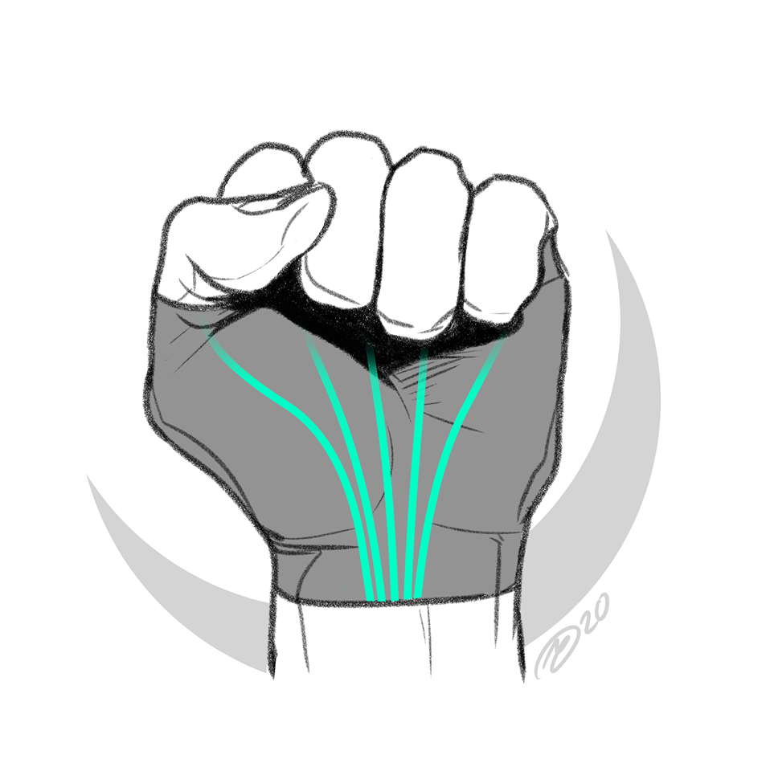

# Yet Another Glove project 



## Description 

Yet Another Glove Project is a wearable glove that is capable of supporting the physiotherapy process by aiding the user in completing exercises for improving finger and tendon strength. 
Using Multiple accelerometer/gyro data, from the MPU6050 sensor, the angle between joint on the hand can be determined and the application will provide the user with feedback showing how close they are to the required angles that the exercise requires. 

The exercises used can be found at Documentation/Exercises.pdf

## Build Intructions 

Install QT5, Qwt and wiringPi

```
sudo apt-get install wiringpi
apt-get install qtdeclaratives5-dev-tools
apt-get install libqwt-qt5-dev
```

Clone this repository 

```
git clone https://github.com/A-Juli/RTEP.git
```

To build & Run (GUI)
```
cd RTEP/Software/ExerciseTests/YAGP_GUI/
qmake
make
./YAGP_GUI
```

NOTE: To clean up the files generated such as .o object files, type 'make clean' once finished running the GUI to delete diskspace. (Will require running qmake and make again)

To build & Run (CLI/Terminal/Command Prompt)
```
cd RTEP/Software/ExerciseTests/
make
./Exerciseprogram
```

## Important Notice - COVID19 lockdown
Due to COVID19 the University of Glasgow was closed and  work on the hardware was halted as access to electronics labs have been restricted.
However, before the lockdown various aspects of the hardware and software were completed. 
### Progress of Hardware (before lockdown) 
For the hardware, the design of circuitry and PCBs were completed for the two boards.
Only one board with the MPU6050 had been fully assembled and tested.
This testing involved reading data for the accelerometer from the buffers which would be needed to calculate the angles in the project.

The board with the I2C multiplexer was assembled and tested.
The board was built in the final week before the university was lockdowned and was not working by the time lockdown occured.
Debugging could not be performed due to lack of access to the electronic labs.
Power was provided to the board but no communication over I2C was achieved between the raspberry pi and the main board.
### Progress of Software (before lockdown) 
For the software, programs had been written that allowed the raspberry pi to communicate over I2C and sample data from the MPU6050 registers using a timer. 
Work had been started on the GUI but no significant progress had been made. The GUI itself is composed of two exercises which are simulated/'Unit Tested', and can be found out more in the documentation section of the report. 

# GUI Demo


As shonw in the gif, the user can select between which exercise to simulate to show the movement of the hand in terms of angle measurements. The user can also pause the simulation at a certain point in time in order to choose specific values as to where to orient the hand.

### Future Development
When the lockdown ends development and assembly of hardware can be continued.
This would mainly involve the assembly of more MPU6050 boards which is needed to demonstrate a select set of exercises. In terms of GUI, OpenGL Libraries would be used such as Mesa3D in order to track the movement of the hand in realtime as the user moves it, in a mode referred to as: Free Roam. Perhaps more customisability to the UI through using Human Computer Interface methods to get user feedback on how the UI could look nicer, and more user friendly.
## Licenses
This project and all the tools used fall under the GNU Public license. All credits and rights are reserved to their authors. Please refer to the LICENSE.md file in this repo to find out more about the rights of the software. Any future work or modifications done to this project requires to be public.
## Authors
* richardajordan: Hardware and Software design 
* basel-shehabi: Porting our code/software to Qt and using it to make the GUI. All rights reserved.
* A-Juli
